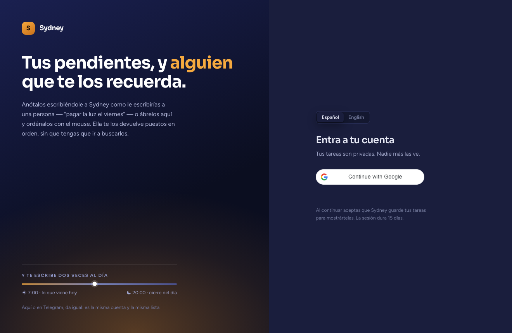

# Sydney — task dashboard

The web half of [Sydney](https://github.com/slabarcaf/melissa-bot), a personal assistant that
lives in a Telegram chat. Same account, same data, a different door: the chat is where she
writes to you, and this is where you look at everything at once and move it around.

It is also the REST API the bot runs on.



Next.js 14 (App Router) · TypeScript strict · Postgres on Neon over raw `pg` · Vercel.
21,000 lines, in production since March 2026, with real users.

---

## What is interesting in here

**Invite-only, decided in one place.** Signing in with Google proves *who you are*, not that you
are allowed in — permission is a row in `users`, and the only thing that creates rows is an
admin invitation. Until 2026-09-11 the sign-in route created the account itself, which meant
anyone on earth with a Google account could walk in and, a minute later, spend the OpenAI key on
transcriptions. The rejection is deliberately **identical** for an address never invited and one
invited and later deleted: telling them apart turns the login into an oracle for finding out who
has an account.

**Bilingual without duplicating anything.** The line that matters is the boundary: *what the user
writes is never translated; what the app wrote is never stored translated.* Category identifiers,
debt direction and status are wire values that travel to Postgres and to Telegram untouched — only
their labels change. So English cost one column and a catalogue, and not a second copy of
anything.

The catalogue deliberately has **no `as const`**: with it, every value pins to its own literal and
the English file would have to contain the Spanish text. Without it, TypeScript enforces key
parity and nothing else — a missing translation is a compile error, not a blank string in
production. The three failure modes were provoked on purpose before the guarantee was trusted.

**A ratchet that checks the thing the compiler cannot.** `tsc` catches a missing key; it is
perfectly happy with an English catalogue whose values are still Spanish — which is exactly what
"copied the file and got interrupted" produces. So the test compares English values against
Spanish ones. The first version hunted accents instead, and was caught passing green on a whole
Spanish sentence that happens to have none.

**Security, briefly:** session tokens stored as SHA-256 hashes, `SameSite=Lax` plus Origin
verification as a second lock, fixed-window rate limiting in Postgres on every route that costs
money, CSP and HSTS headers, and per-user `WHERE user_id = $1` inside the UPDATE itself rather
than as a separate check that can be forgotten.

**Natural-language capture.** You type *"pay the electricity bill friday"* and the date is read
out of the sentence and shown back before you commit — the parser never guesses silently, because
a wrong date is invisible until the reminder fires on the wrong day. It reads both languages, and
ordinal phrases like *"the first monday of october"*, which used to quietly return next Monday.

---

## Layout

```
src/app/          Next.js App Router — 4 pages, all client-rendered, plus the REST API
  api/            tasks, debts, auth, preferences, telegram linking, transcription, admin
src/components/   17 components: board, today list, task card, command palette, onboarding
src/lib/
  i18n/           the es/en catalogues, the provider, formatters, error codes
  server/         db.ts (schema + queries), auth.ts, mail.ts, rateLimit.ts
  parseTaskInput.ts   the natural-language date and category parser
tests/            node:test, run against esbuild-compiled TypeScript
```

The schema is `initialize()` in `src/lib/server/db.ts` — idempotent `CREATE TABLE IF NOT EXISTS`
and `ADD COLUMN IF NOT EXISTS`, no migration directory. That is a deliberate trade for a project
this size and it is written down as one.

## Running it

```bash
npm install
cp .env.example .env.local     # Postgres URL, Google client id, OpenAI key
npm run db:init
npm run dev
```

```bash
npm run check    # tsc --noEmit + eslint + tests, without touching .next
```

⚠️ Never run `npm run build` while `npm run dev` is up — they share `.next`, the production build
overwrites the chunks the dev server is serving, and every route starts returning 500. `npm run
check` exists so the common case never touches `.next` at all.

Deployment notes, account ownership and the known traps are in
[docs/OPERATIONS.md](docs/OPERATIONS.md).

---

## Conventions

Comments explain **why**, not what — and they are mostly written at the moment something broke,
so a good number of them are a short account of a bug and the reason the fix looks the way it
does. Commit messages are the same. If you want to know whether the code is thought through,
`git log` is a better sample than any README.

Two rules the codebase holds to:

- **A check that cannot determine its answer reports failure, never approval.** A green light
  that cannot back its claim is worse than no light.
- **Guarantees live in code, not in prose.** Anything enforced only by a comment or a prompt will
  eventually not be enforced.

*MIT licensed. The assistant half is at
[slabarcaf/melissa-bot](https://github.com/slabarcaf/melissa-bot).*
